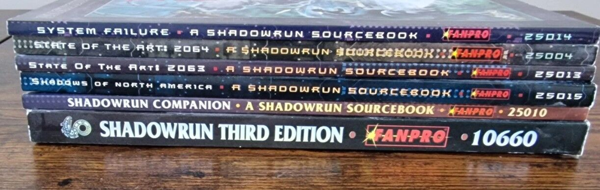
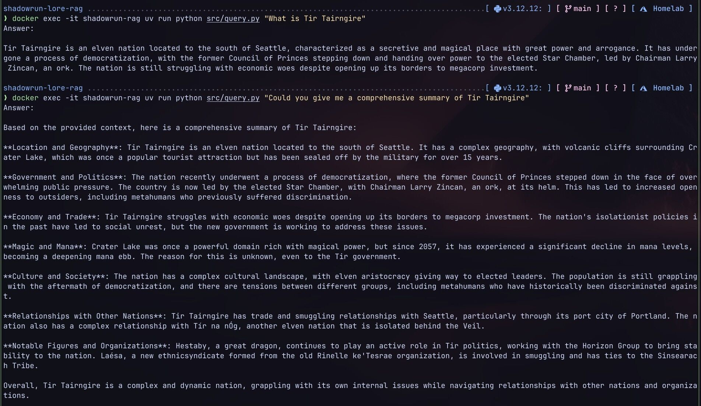
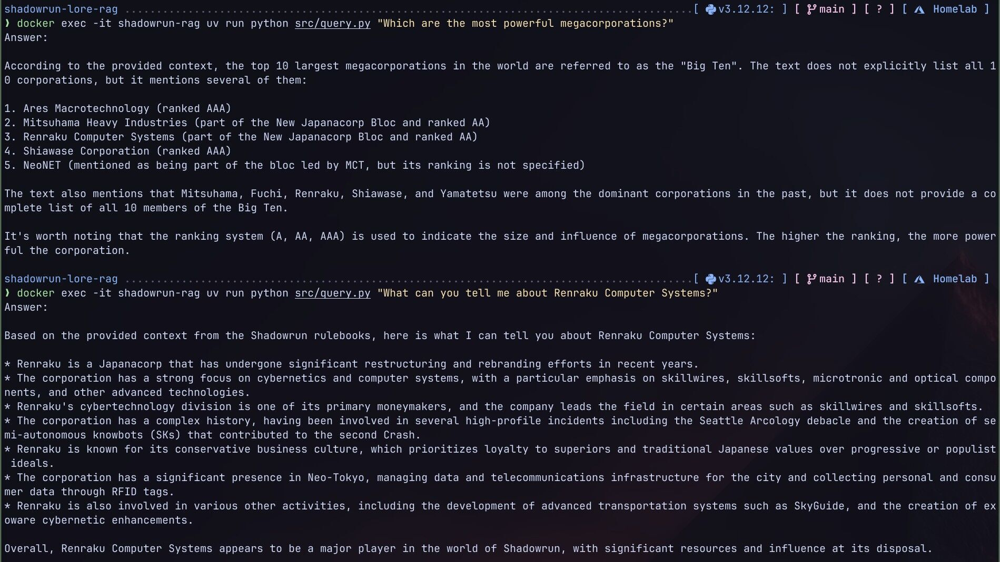

# Shadowrun Lore RAG

A RAG system for querying Shadowrun RPG rulebooks using natural language. Runs on a homelab with Ollama.

Shadowrun is an RPG from the 90s that I have fond memories of. After reading [this guide on RAG embeddings](https://medium.com/@sharanharsoor/the-complete-guide-to-embeddings-and-rag-from-theory-to-production-758a16d747ac), I finally put the idea into action.





## Architecture

Two Docker containers running on homelab hardware with NVIDIA GPU access:

- **shadowrun-rag**: Python 3.12 application (uv for dependency management)
- **ollama-rag**: Ollama server for LLM inference and embeddings

Data stored on host at `/srv/shadowrun-rag/` and mounted into containers:

- `pdfs/` - source rulebook PDFs
- `extracted/` - markdown output from marker-pdf
- `chroma_db/` - ChromaDB vector database (file-based)
- `model_cache/` - marker-pdf model cache

```
PDFs → marker-pdf → markdown → chunks → embeddings → ChromaDB
                                                         ↓
                           query → retrieve → Ollama LLM → answer
```

| Component      | Choice                                    |
| -------------- | ----------------------------------------- |
| PDF extraction | marker-pdf                                |
| Chunking       | langchain-text-splitters (markdown-aware) |
| Embeddings     | Ollama `mxbai-embed-large`                |
| Vector store   | ChromaDB (via langchain-chroma)           |
| LLM            | Ollama `llama3.1:8b` (configurable)       |
| Orchestration  | langchain + langchain-ollama              |

## Development / Deployment

1. Set up `.env` file on the `development machine`
2. Set up necessary dir structure on the `remote machine` you want to run the containers on

```sh
/srv/ollama/        # mount point for ollama
/srv/shadowrun-rag/ # mount point for shadowrun-rag
├── pdfs/           # Source PDFs (read-only)
├── extracted/      # Markdown output from marker-pdf
└── chroma_db/      # Vector database
```

```sh
# On the remote machine
sudo mkdir -p /srv/ollama
sudo mkdir -p /srv/shadowrun-rag/{pdfs,extracted,chroma_db,model_cache}
sudo chown -R $SHDWRN_REMOTE_USER :$SHDWRN_REMOTE_USER /srv/shadowrun-rag
# place the pdfs into /srv/shadowrun-rag/pdfs
```

3. Create a docker context for the `remote machine` where the containers will be running (or skip this step if you are runnig the containers)

```sh
docker context create shadowrun-rag --docker "host=ssh://$SHDWRN_REMOTE_USER@$SHDWRN_REMOTE_HOST"
docker context use shadowrun-rag
```

4. Build and deploy the compose file from the `deployment machine`

```sh
docker compose build
docker compose down && docker compose up -d
```

5. Run the following scripts from the `development machine`

```sh
ssh $SHDWRN_REMOTE_USER@$SHDWRN_REMOTE_HOST docker exec ollama-rag ollama pull mxbai-embed-large
ssh $SHDWRN_REMOTE_USER@$SHDWRN_REMOTE_HOST docker exec ollama-rag ollama pull llama3.1:8b
ssh $SHDWRN_REMOTE_USER@$SHDWRN_REMOTE_HOST docker exec shadowrun-rag uv run python src/convert_pdfs_to_markdown.py
ssh $SHDWRN_REMOTE_USER@$SHDWRN_REMOTE_HOST docker exec shadowrun-rag uv run python src/create_embeddings.py
# Or run this if you are running the containers locally
# docker exec shadowrun-rag uv run python src/convert_pdfs_to_markdown.py
# This will:
# - Convert PDFs to markdown using marker-pdf
# - Chunk the markdown into ~1000 char pieces
# - Generate embeddings and store in ChromaDB

# Also while it is running worth verifying if the GPU is being used
ssh $SHDWRN_REMOTE_USER@$SHDWRN_REMOTE_HOST nvidia-smi
+-----------------------------------------------------------------------------------------+
| NVIDIA-SMI 580.126.09             Driver Version: 580.126.09     CUDA Version: 13.0     |
+-----------------------------------------+------------------------+----------------------+
| GPU  Name                 Persistence-M | Bus-Id          Disp.A | Volatile Uncorr. ECC |
| Fan  Temp   Perf          Pwr:Usage/Cap |           Memory-Usage | GPU-Util  Compute M. |
|                                         |                        |               MIG M. |
|=========================================+========================+======================|
|   0  NVIDIA GeForce RTX 3060        Off |   00000000:01:00.0 Off |                  N/A |
|  0%   40C    P2             36W /  170W |    3453MiB /  12288MiB |      0%      Default |
|                                         |                        |                  N/A |
+-----------------------------------------+------------------------+----------------------+

+-----------------------------------------------------------------------------------------+
| Processes:                                                                              |
|  GPU   GI   CI              PID   Type   Process name                        GPU Memory |
|        ID   ID                                                               Usage      |
|=========================================================================================|
|    0   N/A  N/A           17892      C   /app/.venv/bin/python3                 3444MiB |
+-----------------------------------------------------------------------------------------+
```

6. Once the PDFs have been analyzed have fun

```sh
docker exec -it shadowrun-rag uv run python src/query.py "What is Tir Tairngire"
docker exec -it shadowrun-rag uv run python src/query.py "How does magic work?" --sources
```

## Container Configuration

| Variable          | Description                  | Required | Default                   |
| ----------------- | ---------------------------- | -------- | ------------------------- |
| `OLLAMA_HOST`     | Ollama API URL               | No       | `http://ollama-rag:11434` |
| `EMBEDDING_MODEL` | Ollama model for embeddings  | No       | `mxbai-embed-large`       |
| `LLM_MODEL`       | Ollama model for answers     | No       | `llama3.1:8b`             |
| `DATA_PATH`       | Base path for data files     | No       | `/srv/shadowrun-rag`      |
| `CHUNK_SIZE`      | Text chunk size (characters) | No       | `1000`                    |
| `CHUNK_OVERLAP`   | Overlap between chunks       | No       | `200`                     |
| `TOP_K`           | Number of chunks to retrieve | No       | `5`                       |
| `LOG_LEVEL`       | Logging level                | No       | `INFO`                    |

Secrets are stored in: None
