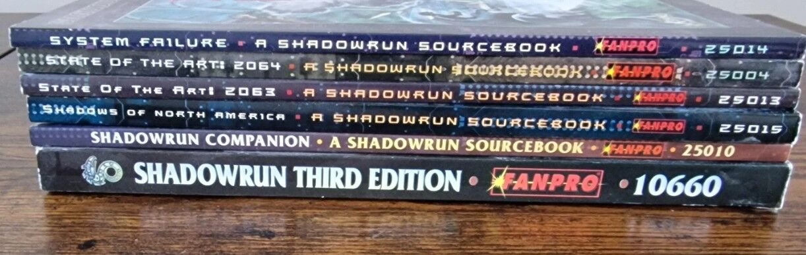
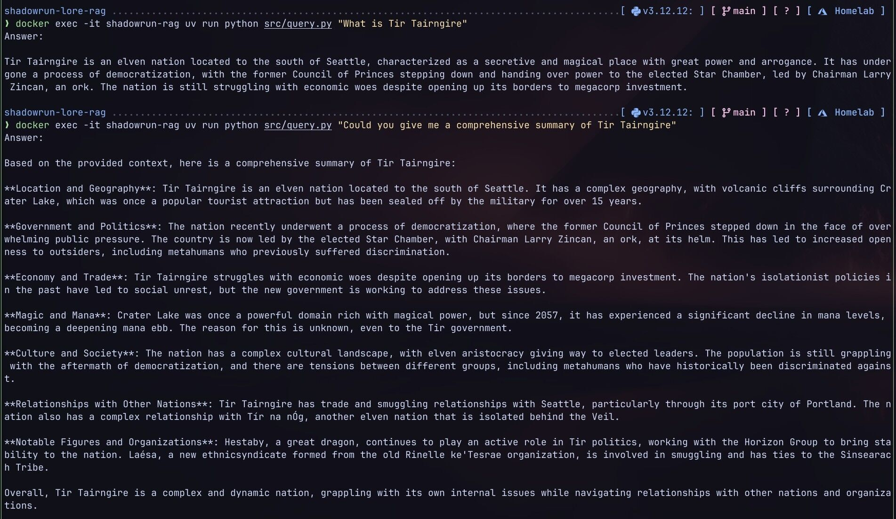
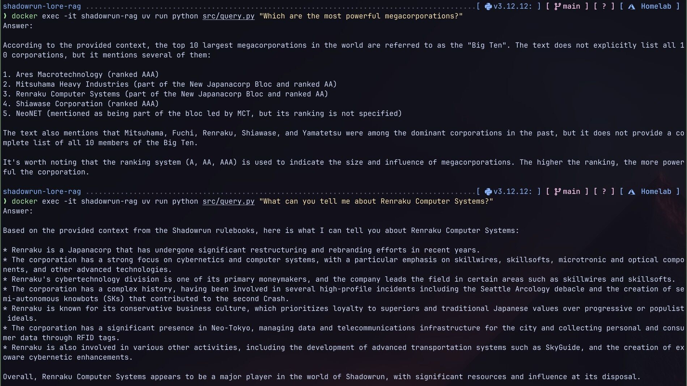

# Shadowrun Lore RAG

A RAG system for querying Shadowrun RPG rulebooks using natural language. Runs on a homelab with Ollama.

Shadowrun is an RPG from the 90s that I have fond memories of. After reading [this guide on RAG embeddings](https://medium.com/@sharanharsoor/the-complete-guide-to-embeddings-and-rag-from-theory-to-production-758a16d747ac), I finally put the idea into action.





## Architecture

Two Docker containers running on homelab hardware with NVIDIA GPU access:

- **shadowrun-rag**: Python 3.12 application (uv for dependency management)
- **ollama-rag**: Ollama server for LLM inference and embeddings

```
pdfs_raw/ → normalise → pdfs_normalised/ → marker-pdf → markdown/ → chunks → embeddings → ChromaDB
                                                                                              ↓
                                                          query → retrieve → Ollama LLM → answer
```

| Component      | Choice                                    |
| -------------- | ----------------------------------------- |
| PDF extraction | marker-pdf                                |
| Chunking       | langchain-text-splitters (markdown-aware) |
| Embeddings     | Ollama `mxbai-embed-large`                |
| Vector store   | ChromaDB (via langchain-chroma)           |
| LLM            | Ollama `llama3.1:8b` (configurable)       |
| Orchestration  | langchain + langchain-ollama              |

## Development / Deployment

Deployment is managed via the `personal-homelab` repo. The `compose.yaml` for this service lives there.

1. Set up `.env` file on the development machine
2. Set up necessary dir structure on the remote machine

```sh
/srv/ollama/                  # mount point for ollama
/srv/shadowrun-rag/
├── pdfs_raw/                 # drop raw PDFs here (upload via filebrowser)
├── pdfs_normalised/          # normalised copies, read by extraction pipeline
├── markdown_extracted/       # raw markdown output from marker-pdf
├── markdown_clean/           # post-processed markdown, fed into embeddings
├── chroma_db/                # ChromaDB vector database
└── model_cache/              # marker-pdf model cache
```

```sh
# On the remote machine
sudo mkdir -p /srv/ollama
sudo mkdir -p /srv/shadowrun-rag/{pdfs_raw,pdfs_normalised,markdown_extracted,markdown_clean,chroma_db,model_cache}
sudo chown -R $SHDWRN_REMOTE_USER:$SHDWRN_REMOTE_USER /srv/shadowrun-rag
```

3. Deploy via `personal-homelab` repo (builds image and starts containers)

4. Pull Ollama models

```sh
ssh $SHDWRN_REMOTE_USER@$SHDWRN_REMOTE_HOST docker exec ollama ollama pull mxbai-embed-large
ssh $SHDWRN_REMOTE_USER@$SHDWRN_REMOTE_HOST docker exec ollama ollama pull llama3.1:8b
```

5. Upload PDFs via filebrowser into `pdfs_raw/`, then run the pipeline

```sh
mise run normalise   # copy PDFs from pdfs_raw/ to pdfs_normalised/ with normalised filenames
mise run convert     # convert PDFs to markdown
mise run embed       # create embeddings and store in ChromaDB
```

6. Query

```sh
mise run query -- "What is Tir Tairngire"
mise run query -- "How does magic work?"
```

## Container Configuration

| Variable          | Description                  | Required | Default                   |
| ----------------- | ---------------------------- | -------- | ------------------------- |
| `OLLAMA_HOST`     | Ollama API URL               | No       | `http://ollama:11434`     |
| `EMBEDDING_MODEL` | Ollama model for embeddings  | No       | `mxbai-embed-large`       |
| `LLM_MODEL`       | Ollama model for answers     | No       | `llama3.1:8b`             |
| `DATA_PATH`       | Base path for data files     | No       | `/data`                   |
| `CHUNK_SIZE`      | Text chunk size (characters) | No       | `1000`                    |
| `CHUNK_OVERLAP`   | Overlap between chunks       | No       | `200`                     |
| `TOP_K`           | Number of chunks to retrieve | No       | `5`                       |
| `LOG_LEVEL`       | Logging level                | No       | `INFO`                    |

Secrets are stored in: None
